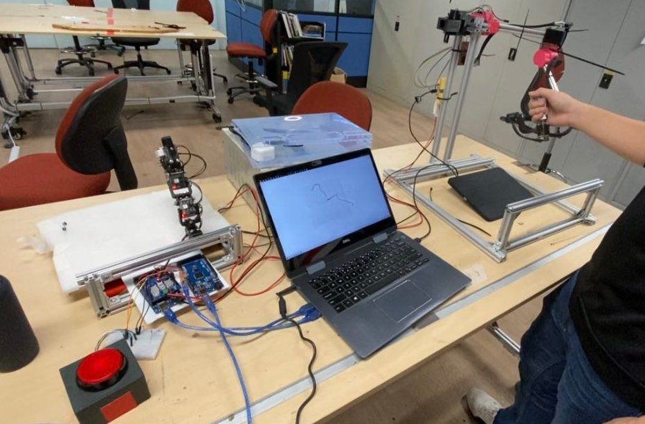
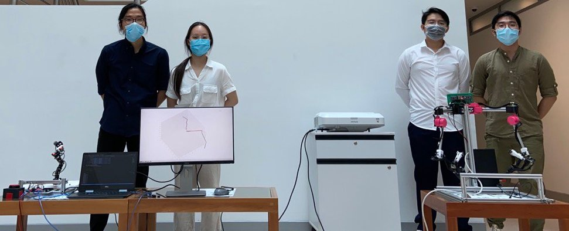

# Photo

- Inspired by the DaVinci surgical robot, we wanted to build a 6-DOF controller that allows the operator to control the end-effector pose of a robot
  
- The team behind it
  

### [Go back Home](../README.md)
