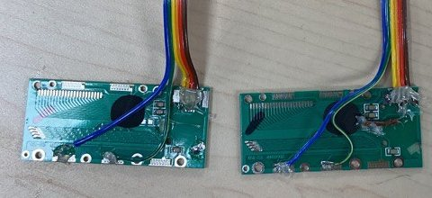
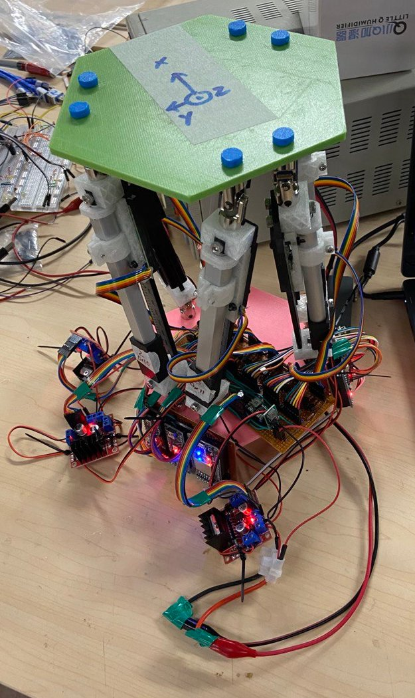

# Photo
- Since the commercially avalable encoder is too expensive, we decided to reverse engineer a digital vernier caliper as the distance measurement device

- The platform consists of 6 encoded linear actuator with 6 microprocessor performing PID control and communicate with a master microprocessor. The relative pose between the top and bottom platform are calculated and visualized using python on a laptop

# Video

- Result!
  [Video](../assets/vid/stewart.mp4)

### [Go back Home](../README.md)
